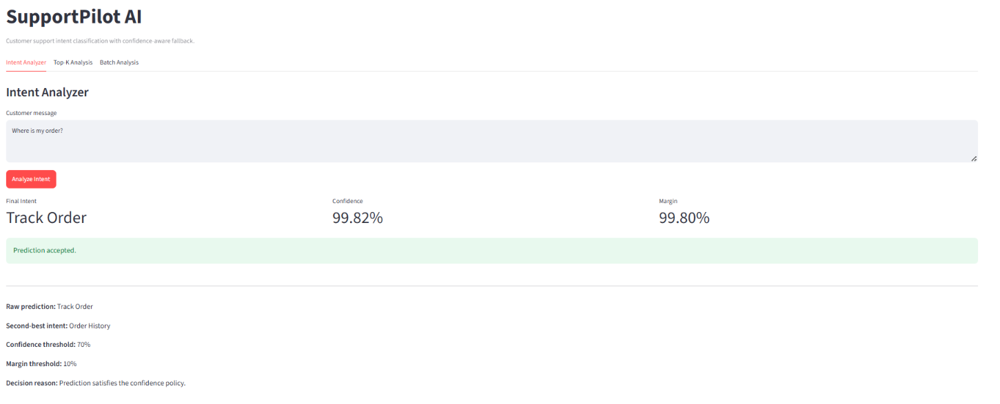
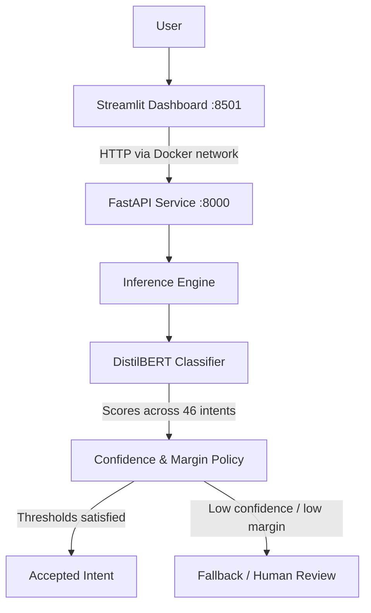

# SupportPilot AI

**Production-oriented NLP system for e-commerce customer support intent classification.**

[](https://github.com/abdulmuinn/supportpilot-ai/actions/workflows/ci.yml)


[](https://huggingface.co/abdulmuinnn/supportpilot-distilbert)

SupportPilot AI classifies customer support messages into **46 intents** using a fine-tuned **DistilBERT** model and exposes inference through a **FastAPI REST API**, an interactive **Streamlit dashboard**, and a containerized **Docker Compose** deployment stack.

The project demonstrates an end-to-end ML engineering workflow: model evaluation, reusable inference logic, confidence-aware fallback behavior, API serving, dashboard integration, automated testing, CI, and containerized deployment.

---

## Demo



Example prediction for an e-commerce support message using the containerized Streamlit → FastAPI → DistilBERT inference stack.

---

## What This Project Demonstrates

This repository is designed as an ML engineering case study rather than only a model-training experiment.

It demonstrates how an NLP model can be turned into a reusable software system through:

- modular inference architecture
- REST API serving
- confidence-aware fallback decisions
- interactive client integration
- batch inference
- automated testing
- continuous integration
- containerized multi-service deployment

---

## Business Problem

Customer support teams receive large volumes of repetitive messages such as:

- "Where is my order?"
- "I want to cancel my order."
- "How do I reset my password?"
- "When will my package arrive?"

Manually routing every message increases response time and operational workload.

SupportPilot AI is designed to automatically identify the customer's intent so that a support system can route requests to the appropriate workflow, queue, or automation.

---

## Key Capabilities

- Classifies e-commerce support messages across **46 intents**
- Serves predictions through a modular **FastAPI** application
- Provides **single**, **top-k**, and **batch** prediction endpoints
- Uses configurable confidence and margin thresholds
- Routes uncertain predictions to a **fallback / human-review path**
- Provides an interactive **Streamlit** analysis dashboard
- Supports CSV batch inference
- Runs API and UI as separate Docker services
- Uses internal Docker networking between UI and API
- Runs application containers as non-root users
- Includes automated unit and API tests
- Runs CI across Python **3.11 and 3.12**

---

## System Architecture



The Streamlit container does **not** load the ML model directly. It acts as a lightweight client and communicates with the FastAPI service over Docker's internal network.

---

## Model Performance

Three model families were evaluated during development.

| Model | Validation Macro F1 |
|---|---:|
| Logistic Regression | 98.26% |
| Linear SVM | 98.74% |
| DistilBERT | **99.65%** |

The final DistilBERT model achieved the following results on the held-out test set:

| Metric | Result |
|---|---:|
| Test samples | 4,483 |
| Correct predictions | 4,471 |
| Accuracy | **99.73%** |
| Macro F1 | **99.73%** |
| Misclassified samples | 12 |

> These results were measured on the project's held-out dataset and should not be interpreted as guaranteed performance on unseen real-world customer traffic.

---

## Confidence-Aware Inference

High classification accuracy alone is not sufficient for a support automation system.

SupportPilot AI therefore applies a confidence policy after model inference.

Default thresholds:

```text
Minimum confidence: 0.70
Minimum top-1 / top-2 margin: 0.10
Fallback intent: fallback
```

A prediction is accepted only when both thresholds are satisfied.

Example:

```text
Input:
Where is my order?

Prediction:
track_order

Confidence:
99.82%

Margin:
99.80%

Decision:
accepted
```

An uncertain or out-of-domain message can instead be routed to the fallback path for human review.

---

## API

The FastAPI application exposes:

| Method | Endpoint | Purpose |
|---|---|---|
| GET | `/` | Service information |
| GET | `/health` | Health and model status |
| GET | `/model-info` | Model metadata |
| POST | `/predict` | Single prediction |
| POST | `/predict/top-k` | Ranked intent predictions |
| POST | `/predict/batch` | Batch inference |

Example request:

```bash
curl -X POST \
  http://localhost:8000/predict \
  -H "Content-Type: application/json" \
  -d '{"text":"Where is my order?"}'
```

Example response:

```json
{
  "predicted_intent": "track_order",
  "confidence": 0.9982,
  "final_intent": "track_order",
  "accepted": true,
  "status": "accepted"
}
```

Interactive API documentation is available while the API is running at:

```text
http://localhost:8000/docs
```

---

## Streamlit Dashboard

The dashboard provides three analysis workflows:

**Intent Analyzer**

Inspect a single support message, predicted intent, confidence, margin, fallback decision, second-best prediction, and active thresholds.

**Top-K Analysis**

Inspect ranked alternative intents and compare their model confidence.

**Batch Analysis**

Submit multiple messages manually or upload a CSV file, run chunked batch inference, inspect acceptance/fallback rates, analyze predicted-intent distribution, and export results.

Dashboard:

```text
http://localhost:8501
```

---

## Model Artifact Setup

The trained DistilBERT model is publicly available on Hugging Face:

[`abdulmuinnn/supportpilot-distilbert`](https://huggingface.co/abdulmuinnn/supportpilot-distilbert)

For local development, the application can load the model directly from Hugging Face by setting:

`SUPPORTPILOT_MODEL_ID=abdulmuinnn/supportpilot-distilbert`

The inference layer also supports loading a local Hugging Face-compatible model directory.

For detailed configuration options, see:

[Model Artifact Setup](docs/MODEL_SETUP.md)

---

## Docker Quick Start

### 1. Clone the repository

```bash
git clone https://github.com/abdulmuinn/supportpilot-ai.git
cd supportpilot-ai
```

### 2. Configure the model

By default, Docker Compose uses the public SupportPilot model from Hugging Face:

`abdulmuinnn/supportpilot-distilbert`

No local model directory is required.

On the first startup, the API downloads the model from Hugging Face and stores it in a persistent Docker volume. Subsequent container restarts reuse the cached model.

To use a different Hugging Face-compatible model, create a `.env` file and override:

`SUPPORTPILOT_MODEL_ID=organization/model-name`

### 3. Start the stack

```bash
docker compose up -d --build
```

### 4. Verify the services

```bash
docker compose ps
```

Expected services:

```text
api    healthy
ui     healthy
```

API health:

```bash
curl http://localhost:8000/health
```

Streamlit health:

```bash
curl http://localhost:8501/_stcore/health
```

### 5. Stop the stack

```bash
docker compose down
```

---

## Local Development

The project supports Python **3.11 and 3.12**.

Create and activate a virtual environment, then install the project:

```bash
python -m pip install -e ".[dev,dashboard]"
```

Configure the model source:

```bash
export SUPPORTPILOT_MODEL_ID=/path/to/model
```

Run FastAPI:

```bash
python -m uvicorn supportpilot.api.main:app \
  --host 127.0.0.1 \
  --port 8000
```

Run Streamlit in another terminal:

```bash
python -m streamlit run dashboard/streamlit_app.py
```

---

## Testing and CI

Run the full test suite:

```bash
python -m pytest
```

Current test suite:

```text
42 tests
```

Coverage includes:

- confidence policy
- model loading
- prediction engine
- FastAPI endpoints
- API client behavior
- formatting utilities
- batch inference helpers

GitHub Actions runs automated validation on:

```text
Python 3.11
Python 3.12
```

---

## Project Structure

```text
supportpilot-ai/
├── dashboard/
│   └── streamlit_app.py
├── docker/
│   ├── Dockerfile.api
│   └── Dockerfile.ui
├── src/
│   └── supportpilot/
│       ├── api/
│       ├── inference/
│       ├── ui/
│       └── config.py
├── tests/
│   ├── api/
│   └── unit/
├── .github/
│   └── workflows/
├── .dockerignore
├── .env.example
├── docker-compose.yml
├── pyproject.toml
└── README.md
```

---

## Current Limitations

SupportPilot AI is a **production-oriented portfolio system**, not a fully managed production service.

Current limitations include:

- model artifacts are currently supplied separately rather than distributed with the repository
- evaluation results are based on the project dataset rather than live production traffic
- no API authentication or authorization layer
- no rate limiting
- no centralized observability or production monitoring
- no model drift monitoring
- no persistent prediction logging
- deployment is currently optimized for CPU-first local/container execution

These areas are intentionally separated from the core inference system and can be extended depending on deployment requirements.

---

## Project Origin

SupportPilot AI originated from a machine learning final project and was independently redesigned as an ML engineering portfolio case study.

The portfolio version focuses on software engineering and deployment concerns beyond model training, including:

```text
reusable inference architecture
→ API serving
→ confidence-aware decisions
→ dashboard integration
→ automated testing
→ CI
→ Docker deployment
```

---

## Tech Stack

- **Machine Learning:** PyTorch, Hugging Face Transformers, DistilBERT
- **Backend:** FastAPI, Pydantic, Uvicorn
- **Frontend:** Streamlit, Pandas, Altair, HTTPX
- **Testing:** Pytest
- **Deployment:** Docker, Docker Compose
- **CI:** GitHub Actions

---

## License

The source code in this repository is released under the [MIT License](LICENSE).

Dataset sources and separately distributed model artifacts may be subject to their own licensing or usage terms.
